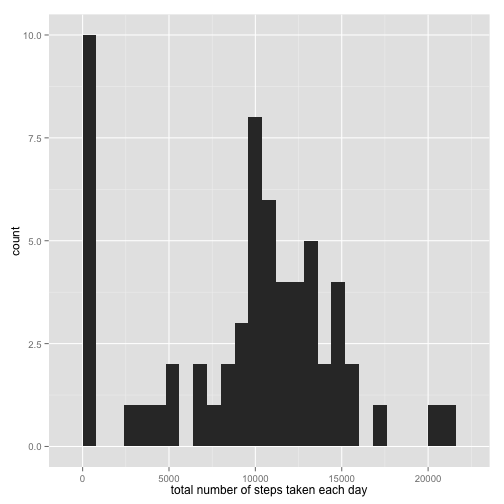
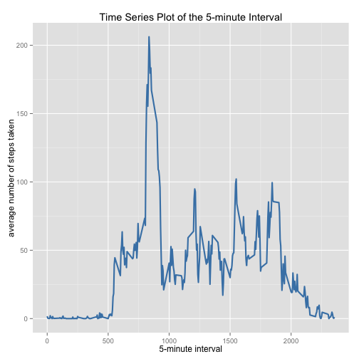
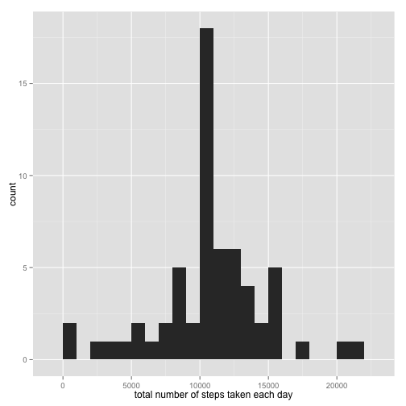
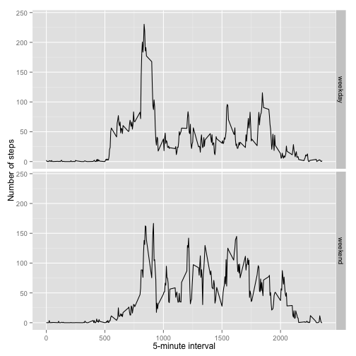

#Reproducible Research: Peer Assignment 1
-----------------------------------------
#Using echo = TRUE ## someone else will be able to read the code.
#Loading and preprocessing the data
#1.Load the data

```r
unzip(zipfile="activity.zip")
```

```
## Warning in unzip(zipfile = "activity.zip"): error 1 al extraer del archivo
## zip
```

```r
activity <- "./activity.csv"
```

```r
#2.Process/transform the data (if necessary) into a format suitable for your analysis
```

```r
data <- read.csv(activity, colClasses = c("integer", "Date", "factor"))
data$month <- as.numeric(format(data$date, "%m"))
str(data)
```

```
## 'data.frame':	17568 obs. of  4 variables:
##  $ steps   : int  NA NA NA NA NA NA NA NA NA NA ...
##  $ date    : Date, format: "2012-10-01" "2012-10-01" ...
##  $ interval: Factor w/ 288 levels "0","10","100",..: 1 226 2 73 136 195 198 209 212 223 ...
##  $ month   : num  10 10 10 10 10 10 10 10 10 10 ...
```

```r
#'data.frame':  17568 obs. of  3 variables:
```

```r
head(data)
```

```
##   steps       date interval month
## 1    NA 2012-10-01        0    10
## 2    NA 2012-10-01        5    10
## 3    NA 2012-10-01       10    10
## 4    NA 2012-10-01       15    10
## 5    NA 2012-10-01       20    10
## 6    NA 2012-10-01       25    10
```

```r
#1.What is mean total number of steps taken per day?
#For this part of the assignment, you can ignore the missing values in the dataset
```

```r
stepsnumber <- tapply(data$steps, data$date, FUN=sum, na.rm=TRUE)
```

```r
head(stepsnumber)
```

```
## 2012-10-01 2012-10-02 2012-10-03 2012-10-04 2012-10-05 2012-10-06 
##          0        126      11352      12116      13294      15420
```

```r
#2.If you do not understand the difference between a histogram and a barplot, research #the difference between them. Make a histogram of the total number of steps taken each #day
```

```r
library(ggplot2)
qplot(stepsnumber, binwidth=800, xlab="total number of steps taken each day")
```

 

```r
#3.Calculate and report the mean and median of the total number of steps taken per day
```

```r
mean(stepsnumber, na.rm=TRUE)
```

```
## [1] 9354.23
```


```r
median(stepsnumber, na.rm=TRUE)
```

```
## [1] 10395
```

```r
#What is the average daily activity pattern?
#1.Make a time series plot (i.e. type = "l") of the 5-minute interval (x-axis) and the #average number of steps taken, averaged across all days (y-axis)
```

```r
average <- aggregate(x=list(steps=data$steps), by=list(interval=as.numeric(as.character(data$interval))),FUN = mean, na.rm = TRUE)
ggplot(data = average, aes(x = interval, y = steps)) + geom_line(color = "steelblue", size = 1) +labs(title = "Time Series Plot of the 5-minute Interval")+ xlab("5-minute interval") + ylab("average number of steps taken")
```

 

```r
#2.Which 5-minute interval, on average across all the days in the dataset, contains #the maximum number of steps?
```

```r
average[which.max(average$steps), ]
```

```
##     interval    steps
## 104      835 206.1698
```

```r
#Imputing missing values
#Note that there are a number of days/intervals where there are missing values (coded #as NA). The presence of missing days may introduce bias into some calculations or #summaries of the data.
#1.Calculate and report the total number of missing values in the dataset (i.e. the #total number of rows with NAs)
```

```r
missingvalues <- is.na(data$steps)
```

```r
table(missingvalues)
```

```
## missingvalues
## FALSE  TRUE 
## 15264  2304
```

```r
#There are 2304 missing values.
#Sum(15264+2304) = 17568 obs.

#2.Devise a strategy for filling in all of the missing values in the dataset. The #strategy does not need to be sophisticated. For example, you could use the mean
#/median for that day, or the mean for that 5-minute interval, etc.
#To solve this problem, I will use the mean for that 5-minute interval to fill each NA #value in the steps column.
```

```r
fill <- function(steps, interval) {
    filled <- NA
   if (!is.na(steps)) 
      filled <- c(steps) else filled <- (average[average$interval == interval, "steps"])
   return(filled)
}
```

```r
filledata <- data
filledatafinal <- mapply(fill, filledata$steps, filledata$interval)
```

```r
#3.Create a new dataset that is equal to the original dataset but with the missing data filled in.
```

```r
newdata <- data 
for (i in 1:nrow(newdata)) {
if (is.na(newdata$steps[i])) {
newdata$steps[i] <- average[which(newdata$interval[i] == average$interval), ]$steps
       }
} 
```

```r
head(newdata)
```

```
##       steps       date interval month
## 1 1.7169811 2012-10-01        0    10
## 2 0.3396226 2012-10-01        5    10
## 3 0.1320755 2012-10-01       10    10
## 4 0.1509434 2012-10-01       15    10
## 5 0.0754717 2012-10-01       20    10
## 6 2.0943396 2012-10-01       25    10
```


```r
sum(is.na(newdata))
```

```
## [1] 0
```

```r
#4.Make a histogram of the total number of steps taken each day and Calculate and #report the mean and median total number of steps taken per day. Do these values #differ from the estimates from the first part of the assignment? What is the impact #of imputing missing data on the estimates of the total daily number of steps?
#Are there differences in activity patterns between weekdays and weekends?
```

```r
fillednewdata <- tapply(filledatafinal, filledata$date, FUN=sum)
qplot(fillednewdata, binwidth=1000, xlab="total number of steps taken each day")
```

 

```r
 mean(fillednewdata)
```

```
## [1] 10766.19
```


```r
 median(fillednewdata)
```

```
## [1] 10766.19
```

```r
#We can observe that these median and mean values are higher than the other ones from #the initial dataset. This can be explained as in the original data there are some #days in which "steps" have missing data values (that means equal to 0). After filling #these missing values with "steps mean of associated interval value","0 values" #disappear and therefore, the median and mean values, increase.  

#For this part the weekdays() function may be of some help here. Use the dataset with #the filled-in missing values for this part.
#1.Create a new factor variable in the dataset with two levels – “weekday” and #“weekend” indicating whether a given date is a weekday or weekend day.
```

```r
newdata$dateType<-ifelse(as.POSIXlt(newdata$date)$wday %in% c(0,6), 'weekend', 'weekday')
```

```r
 averagenewdata <-aggregate(steps ~ interval + dateType, data=newdata, mean)
head(averagenewdata)
```

```
##   interval dateType      steps
## 1        0  weekday  2.2511530
## 2       10  weekday  0.1731656
## 3      100  weekday  0.4205451
## 4     1000  weekday 37.8754717
## 5     1005  weekday 18.2197065
## 6     1010  weekday 39.0775681
```

```r
#2.Make a panel plot containing a time series plot (i.e. type = "l") of the 5-minute #interval (x-axis) and the average number of steps taken, averaged across all weekday #days or weekend days (y-axis). See the README file in the GitHub repository to see an #example of what this plot should look like using simulated data.
```

```r
str(averagenewdata)
```

```
## 'data.frame':	576 obs. of  3 variables:
##  $ interval: Factor w/ 288 levels "0","10","100",..: 1 2 3 4 5 6 7 8 9 10 ...
##  $ dateType: chr  "weekday" "weekday" "weekday" "weekday" ...
##  $ steps   : num  2.251 0.173 0.421 37.875 18.22 ...
```


```r
averagenewdata$interval <- as.numeric(as.character(averagenewdata$interval))
```

```r
ggplot(data=averagenewdata, aes(x=interval, y=steps,ymax = max(steps)*1.05)) +geom_line(aes(interval, steps))+facet_grid(dateType ~ .)+xlab("5-minute interval") + ylab("Number of steps")
```

 

